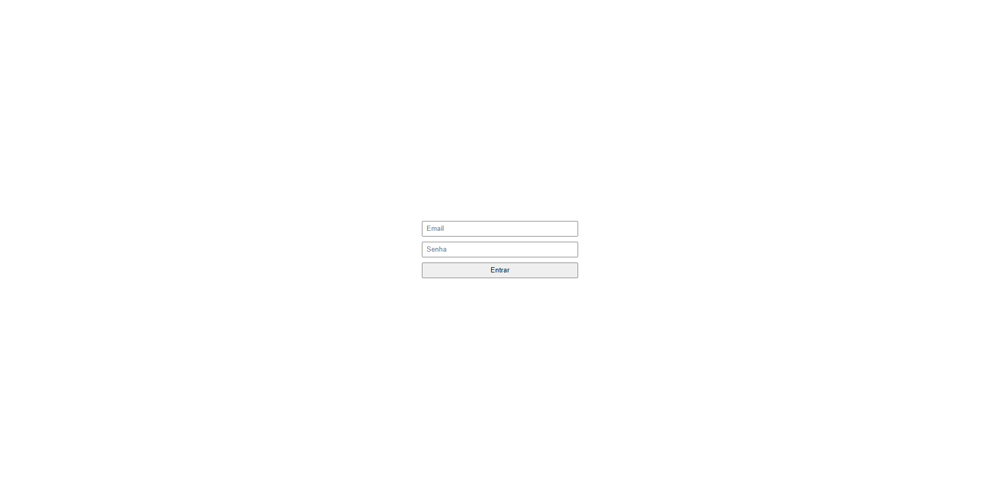

<h1 align="center">
  Autenticação com NextJs 🔐
</h1>

<p align="center">
  
</p>

## 🚀 Tecnologias

Esse projeto foi desenvolvido com as seguintes tecnologias:

- [Next](https://nextjs.org/)
- [Typescript](https://www.typescriptlang.org/)
- [Axios](https://axios-http.com/ptbr/docs/intro)
- [JWT Decode](https://jwt.io/)
- [Nookies](https://github.com/maticzav/nookies)

## Getting Started
### Install dependencies:

```bash
yarn 
```

### Run development server

```bash
yarn dev
```

## Commands

- `yarn start`: run development server

Open [http://localhost:3000](http://localhost:3000) with your browser to see the result.

### Run Back End
- [BackEnd](https://github.com/rocketseat-education/ignite-reactjs-auth-backend)

## 🚧 Projeto:

Concluido

Feito com ♥ by Joelson Junior